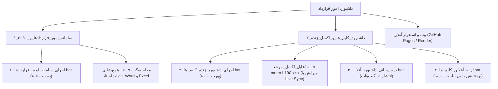

# سامانه جامع امور قراردادها و مهندسی ادعا (Claim Management)
## پروژه احداث خط ۱۰ متروی تهران — قرارگاه سازندگی خاتم‌الانبیاء (ص)

این مخزن شامل **دو سامانه مجزا، تخصصی و در عین حال هماهنگ** برای مدیریت قرارداد و ادعاهای خط ۱۰ متروی تهران است:

---

## 🧭 ساختار و تفکیک دو برنامه فعال



---

### برنامه اول: سامانه جامع امور قراردادها و بخشنامه ۵۰۹۰
- **پوشه اختصاصی**: `۱_سامانه_امور_قراردادها_و_۵۰۹۰/`
- **نحوه اجرا**: با دوبار کلیک روی `۱_اجرای_سامانه_امور_قراردادها.bat` در ریشه پروژه
- **آدرس مرورگر**: `http://localhost:8050`
- **امکانات کلیدی**:
  1. پایش مالی صورت‌وضعیت‌ها و پیش‌پرداخت‌ها (ماده ۳۷ شرایط عمومی پیمان).
  2. رصد معارضین ملکی و تاسیساتی جبهه‌های کاری شفت‌ها و ایستگاه‌ها (ماده ۲۸).
  3. موتور خودکار محاسبه تاخیرات بخشنامه ۵۰۹۰ و تحلیل همپوشانی (Overlap Analysis).
  4. دانشنامه قوانین و نشریه ۴۳۱۱.
  5. استودیوی تولید لوایح رسمی Word (`.docx`) و دفترچه محاسبات اکسل فرموله‌شده (`.xlsx`).

---

### برنامه دوم: داشبورد زنده کلیم‌ها و موارد اختلافی (متصل به اکسل)
- **پوشه اختصاصی**: `۲_داشبورد_کلیم_ها_و_اکسل_زنده/`
- **فایل اکسل مرجع واحد**: `۲_داشبورد_کلیم_ها_و_اکسل_زنده\فایل_اکسل_مرجع\claim metro L100.xlsx`
- **نحوه اجرای زنده (Live Sync)**: با دوبار کلیک روی `۲_اجرای_داشبورد_زنده_کلیم_ها.bat` در ریشه پروژه
- **آدرس مرورگر**: `http://localhost:8090`
- **نحوه پرزنتیشن آفلاین (بدون نیاز به سرور یا پایتون)**: با دوبار کلیک روی `۴_ارائه_آفلاین_کلیم_ها.bat`
- **نحوه ارسال به سایت اینترنتی**: با دوبار کلیک روی `۳_بروزرسانی_داشبورد_آنلاین.bat`
- **امکانات کلیدی**:
  1. پایش ۴۲ کلیم کارفرما و ۷ پرونده ادعایی پیمانکاران دست‌دوم مستقیماً از شیت TOTAL اکسل.
  2. نقشه تعاملی و متحرک حباب‌های ارزش مالی پرونده‌ها (Financial Bubbles Map).
  3. همگام‌سازی زنده و آنی با فشردن `Ctrl+S` در نرم‌افزار اکسل، بدون نیاز به رفرش مرورگر.
  4. پشتیبانی از تم تاریک/روشن و تبدیل آنی واحد به «میلیارد تومان»، «همت» و «ریال».
  5. لینک آنلاین: [https://hoomansa7-star.github.io/metro10-claim-dashboard/web/claims_presentation.html](https://hoomansa7-star.github.io/metro10-claim-dashboard/web/claims_presentation.html)

---

## 📂 درخت پوشه‌بندی مرتب پروژه

```text
داشبورد امور قرارداد/
│
├── ۱_اجرای_سامانه_امور_قراردادها.bat        ◄ اجرای برنامه اول (پورت ۸۰۵۰)
├── ۲_اجرای_داشبورد_زنده_کلیم_ها.bat        ◄ اجرای برنامه دوم زنده با اکسل (پورت ۸۰۹۰)
├── ۳_بروزرسانی_داشبورد_آنلاین.bat          ◄ استخراج اکسل و انتشار در اینترنت (GitHub Pages)
├── ۴_ارائه_آفلاین_کلیم_ها.bat              ◄ پرزنتیشن سریع بدون نیاز به پایتون یا سرور
│
├── ۱_سامانه_امور_قراردادها_و_۵۰۹۰/         ◄ [برنامه اول] سامانه جامع امور قراردادها
│   ├── اجرای_سامانه_قراردادها.bat
│   ├── server.py
│   ├── run_dashboard.py
│   ├── core/                               ◄ موتورهای محاسباتی (۵۰۹۰، ورد، اکسل، جلالی)
│   ├── data/                               ◄ پایگاه‌های داده پیمان خط ۱۰
│   ├── output_documents/                   ◄ نامه‌ها و لوایح تولیدشده
│   ├── web/                                ◄ فرانت‌اند امور قراردادها
│   └── راهنمای_سامانه.md
│
├── ۲_داشبورد_کلیم_ها_و_اکسل_زنده/          ◄ [برنامه دوم] داشبورد زنده ادعاها
│   ├── اجرای_داشبورد_زنده.bat
│   ├── ارائه_آفلاین_کلیم_ها.bat
│   ├── بروزرسانی_داشبورد_آنلاین.bat
│   ├── live_server.py
│   ├── sync_and_push.py
│   ├── فایل_اکسل_مرجع/                     ◄ تنها مرجع رسمی اکسل ادعاها (claim metro L100.xlsx)
│   ├── core/                               ◄ پردازشگر زنده شیت TOTAL
│   ├── data/                               ◄ داده ساختاریافته کلیم‌ها (JSON)
│   ├── web/                                ◄ فرانت‌اند داشبورد و نقشه حباب‌ها
│   └── راهنمای_استفاده.md
│
└── _archive_backup/                        ◄ پوشه پشتیبان امن فایل‌های قدیمی و زائد (مستثنی از گیت)
```
